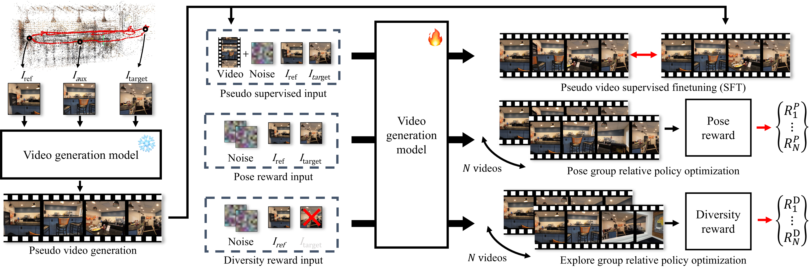
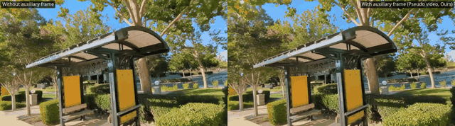

<h1 align="center">ExPose: Reinforcing Video Generation Models<br>for Extreme Pose Estimation</h1>

<p align="center">
  <b>Youngho Yoon</b><sup>1</sup> &nbsp;·&nbsp;
  <b>Wonjune Cho</b><sup>2</sup> &nbsp;·&nbsp;
  <b>Hyunho Ha</b><sup>2</sup> &nbsp;·&nbsp;
  <b>Sujung Kim</b><sup>2</sup> &nbsp;·&nbsp;
  <b>Kuk-Jin Yoon</b><sup>1</sup>
</p>

<p align="center">
  <sup>1</sup>Visual Intelligence Lab., KAIST &nbsp;&nbsp;&nbsp; <sup>2</sup>NAVER LABS
</p>

<p align="center">
  <b>CVPR 2026</b>
</p>

<p align="center">
  <a href="https://yh-yoon.github.io/expose-project-page/">
    
  </a>
  &nbsp;
  <a href="https://openaccess.thecvf.com/content/CVPR2026/papers/Yoon_ExPose_Reinforcing_Video_Generation_Models_for_Extreme_Pose_Estimation_CVPR_2026_paper.pdf">
    
  </a>
</p>

> ### 👉 Looking for results, comparisons, and interactive visualizations, **[Visit the Project Page »](https://yh-yoon.github.io/expose-project-page/)**

<p align="center">
  
</p>

## Abstract

Pose estimation remains challenging under sparse views, especially when visual overlap across
images is extremely limited. Recent advances in video generation models offer a promising
solution by enabling keyframe interpolation, which can enrich contextual cues and improve pose
estimation performance. However, existing video generation models often lack 3D consistency,
producing temporally plausible but spatially inconsistent frames that degrade downstream pose
estimation. In this paper, we propose a framework **ExPose** that directly addresses 3D
inconsistency when applying video generation to pose estimation in extreme-view settings.
Specifically, we fine-tune a video generation model using Group Relative Preference Optimization
(GRPO), aligning its outputs with 3D-consistent supervisory signals derived from pose estimation
objectives. Our approach not only enhances the quality of temporal interpolation, but also ensures
spatial coherence across views, significantly improving pose estimation accuracy. Extensive
experiments demonstrate that our method outperforms state-of-the-art baselines, highlighting the
potential of preference-optimized video generation as a powerful tool for pose estimation in
extreme-view scenarios.

## Demo

<p align="center">
  
</p>

<p align="center">
  ▶️ <b><a href="https://yh-yoon.github.io/expose-project-page/">See more video comparisons on the Project Page</a></b>
</p>

## Code

📌 **Code release is coming soon.**

## Citation

If you find our work useful, please consider citing:

```bibtex
@InProceedings{Yoon_2026_CVPR,
    author    = {Yoon, Youngho and Cho, Wonjune and Ha, Hyunho and Kim, Sujung and Yoon, Kuk-Jin},
    title     = {ExPose: Reinforcing Video Generation Models for Extreme Pose Estimation},
    booktitle = {Proceedings of the IEEE/CVF Conference on Computer Vision and Pattern Recognition (CVPR)},
    month     = {June},
    year      = {2026},
    pages     = {32636-32646}
}
```

